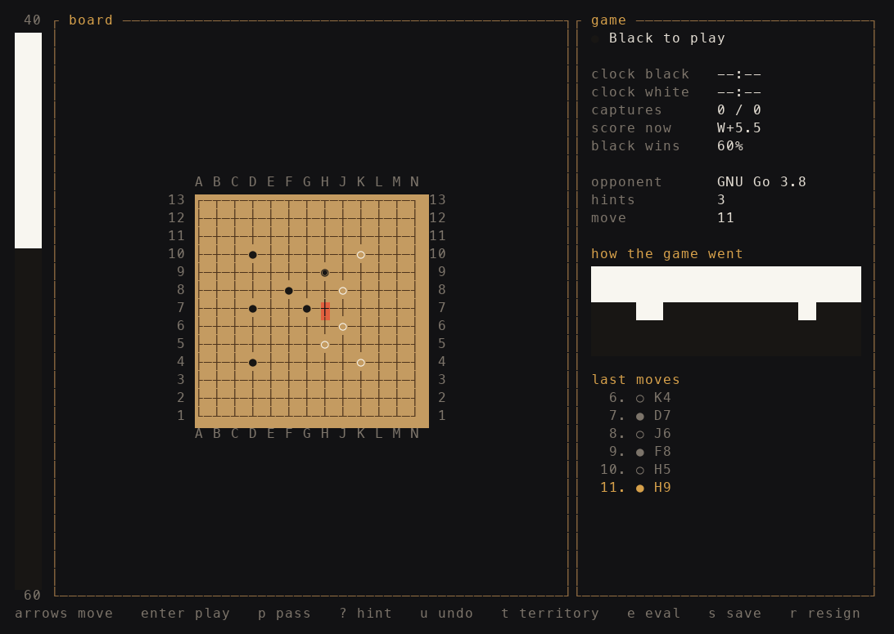

# go-tui

Go in the terminal. Play a friend on the same keyboard, play the computer, and
look through the game afterwards with an eval bar and a move by move judgement.

Written in Rust with [ratatui](https://github.com/ratatui/ratatui).



## What you get

- 9x9, 13x13 and 19x19 boards, handicap stones and komi
- Two people on one keyboard, or one person against an engine
- A built-in engine that runs a search tree over random games, ten strength steps
- Any GTP engine as the opponent instead, GNU Go out of the box
- An eval bar down the side and a graph of how the game has gone so far
- A review screen that walks the engine through every move and marks the
  inaccuracies, mistakes and blunders
- Games saved as SGF, and any SGF loaded back for review
- Hints, undo, a territory overlay, clocks with increment
- Six colour themes, Tab switches between them anywhere in the app

## Install

You need Rust. Get it from [rustup.rs](https://rustup.rs) if you have not
already.

```bash
git clone https://github.com/r-stisen/go-game-tui.git
cd go-game-tui
cargo run --release
```

The binary ends up in `target/release/go-tui`.

## A stronger opponent

The built-in engine is fine on 9x9 and passable on 19x19, but it is not strong.
For a real game install GNU Go and pick it on the setup screen:

```bash
brew install gnu-go        # macOS
sudo apt install gnugo     # Debian, Ubuntu
```

Any other engine that speaks GTP works too. Put the command in
`~/.config/go-tui/config`:

```
engine_command = katago gtp -model model.bin.gz -config gtp.cfg
```

That file also keeps your theme, board size, komi and strength between runs.

## Keys

In a game:

| Key | What it does |
|---|---|
| arrows or `h j k l` | move the cursor |
| enter or space | put a stone down |
| `p` | pass |
| `?` | ask the engine where to play |
| `u` | take a move back |
| `t` | show who owns what |
| `e` | show or hide the eval bar |
| `s` | save the game as SGF |
| `r` | resign |
| esc | back to the menu |

In the review screen left and right step through the moves, up and down jump ten
at a time, and `a` starts the engine on the whole game. The winrate graph fills
in as it works, and each move gets a mark when the engine thinks you dropped the
ball.

`Tab` changes the colours at any time.

## Scoring

Chinese rules. You count your stones on the board plus the empty points only your
stones surround, and White adds komi. Both players passing ends the game.

## Layout

```
src/
  game.rs       board, groups, liberties, ko, scoring
  ai.rs         the search tree and the random games it runs
  gtp.rs        talking to GNU Go or any other GTP engine
  analysis.rs   walking a finished game and judging the moves
  sgf.rs        reading and writing SGF
  theme.rs      the colour sets
  config.rs     the settings file
  app.rs        game session, review, menus
  ui.rs         everything on screen
  main.rs       the loop and the keys
```

## License

MIT
